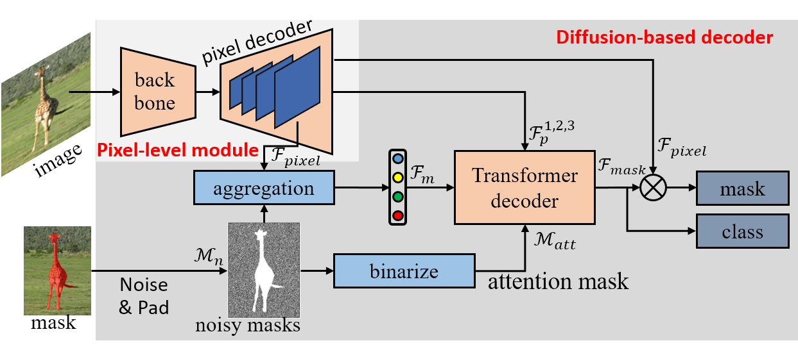

# DFormer: Diffusion-guided Transformer for Universal Image Segmentation

Hefeng Wang, Jiale Cao, Rao Muhammad Anwer, Jin Xie,
Fahad Shahbaz Khan, Yanwei Pang



## Installation

See [installation instructions](INSTALL.md).

## Getting Started

See [Preparing Datasets for DFormer](datasets/README.md).

See [Getting Started with DFormer](GETTING_STARTED.md).


## Model Zoo and Baselines

We provide the baseline results and trained models available for download.
## COCO Model Zoo

### Panoptic Segmentation

<table><tbody>
<!-- START TABLE -->
<!-- TABLE HEADER -->
<th valign="bottom">Name</th>
<th valign="bottom">Backbone</th>
<th valign="bottom">epochs</th>
<th valign="bottom">PQ</th>
<th valign="bottom">download</th>
<!-- TABLE BODY -->
<!-- ROW: dformer_R50_bs16_50ep -->
 <tr><td align="left"><a href="configs/coco/panoptic-segmentation/dformer2_R50_bs16_50ep.yaml">DFormer</a></td>
<td align="center">R50</td>
<td align="center">50</td>
<td align="center">51.1</td>
<td align="center"><a href="https://pan.baidu.com/s/1-nS9BVvemRz20oB8iABhkA?pwd=xg6r">model</a></td>
</tr>
<!-- ROW: dformer_swin_tiny_bs16_50ep -->
 <tr><td align="left"><a href="configs/coco/panoptic-segmentation/swin/dformer_swin_tiny_bs16_50ep.yaml">DFormer</a></td>
<td align="center">Swin-T</td>
<td align="center">50</td>
<td align="center">52.5</td>

<td align="center"><a href="https://pan.baidu.com/s/1em8yVsaFbQjvGSJ5qVT88w?pwd=8gfq">model</a></td>
</tr>
</tbody></table>


### Instance Segmentation

<table><tbody>
<!-- START TABLE -->
<!-- TABLE HEADER -->
<th valign="bottom">Name</th>
<th valign="bottom">Backbone</th>
<th valign="bottom">epochs</th>
<th valign="bottom">AP</th>
<th valign="bottom">download</th>
<!-- TABLE BODY -->
<!-- ROW: dformer_R50_bs16_50ep -->
 <tr><td align="left"><a href="configs/coco/instance-segmentation/dformer_R50_bs16_50ep.yaml">DFormer</a></td>
<td align="center">R50</td>
<td align="center">50</td>
<td align="center">42.6</td>
<td align="center"><a href="https://pan.baidu.com/s/1arjRIxfqpnjqaYOG0W6r9g?pwd=9pah">model</a></td>
</tr>
<!-- ROW: dformer_swin_tiny_bs16_50ep -->
 <tr><td align="left"><a href="configs/coco/instance-segmentation/swin/dformer_swin_tiny_bs16_50ep.yaml">DFormer</a></td>
<td align="center">Swin-T</td>
<td align="center">50</td>
<td align="center">44.4</td>
<td align="center"><a href="https://pan.baidu.com/s/1YcOdvacuWbOIewmByybN2Q?pwd=ewgk">model</a></td>
</tr>
</tbody></table>


## ADE20K Model Zoo


### Semantic Segmentation

<table><tbody>
<!-- START TABLE -->
<!-- TABLE HEADER -->
<th valign="bottom">Name</th>
<th valign="bottom">Backbone</th>
<th valign="bottom">iterations</th>
<th valign="bottom">mIoU</th>
<th valign="bottom">download</th>
<!-- TABLE BODY -->
<!-- ROW: dformer_R50_bs16_160k -->
 <tr><td align="left"><a href="configs/ade20k/semantic-segmentation/dformer_R50_bs16_160k.yaml">DFormer</a></td>
<td align="center">R50</td>
<td align="center">160k</td>
<td align="center">46.7</td>
<td align="center"><a href="https://pan.baidu.com/s/14I9sU9jDpn8tq557ucfEaw?pwd=j5iq">model</a></td>
</tr>
<!-- ROW: dformer_swin_tiny_bs16_160k -->
 <tr><td align="left"><a href="configs/ade20k/semantic-segmentation/swin/dformer_swin_tiny_bs16_160k.yaml">DFormer</a></td>
<td align="center">Swin-T</td>
<td align="center">160k</td>
<td align="center">48.3</td>
<td align="center"><a href="https://pan.baidu.com/s/1fBUnQ0gMfeJmxhRjRegPBg?pwd=4cfr">model</a></td>
</tr>

</tbody></table>


## <a name="CitingMask2Former"></a>Citing DFormer

If you use DFormer in your research or wish to refer to the baseline results published in the Model Zoo and Baselines, please use the following BibTeX entry.

```BibTeX
@inproceedings{wangdformer,
  title={DFormer: Diffusion-guided Transformer for Universal Image Segmentation},
  author={Hefeng Wang, Jiale Cao, Rao Muhammad Anwer, Jin Xie, Fahad Shahbaz Khan, Yanwei Pang},
  journal={arXiv:2306.03437},
  year={2023}
}
```


## Acknowledgement
Many thanks to the nice work of Mask2Former @[Bowen Cheng](https://bowenc0221.github.io/) and DDIM @[Jiaming Song](http://tsong.me). Our codes and configs follow [Mask2Former](https://github.com/facebookresearch/Mask2Former) and [DDIM](https://github.com/ermongroup/ddim).
